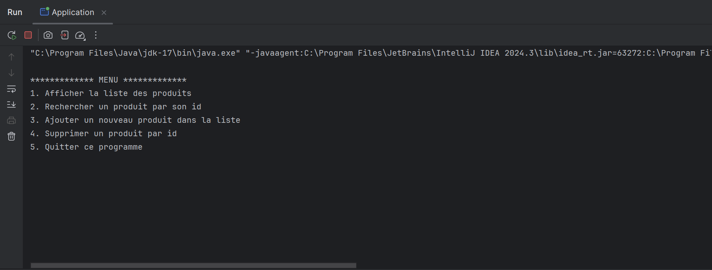
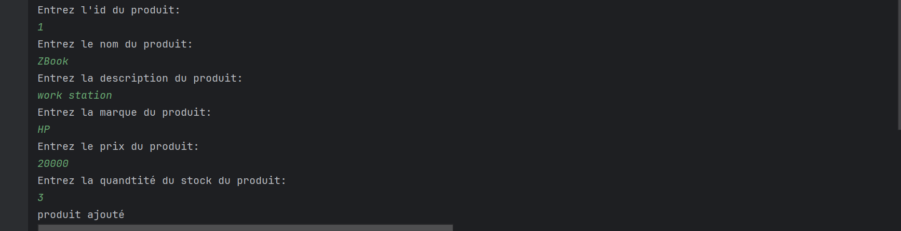
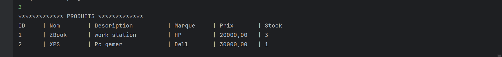
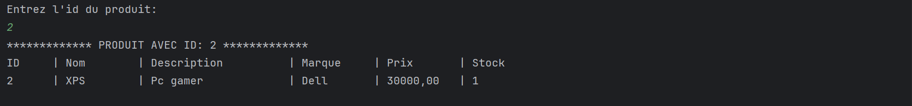
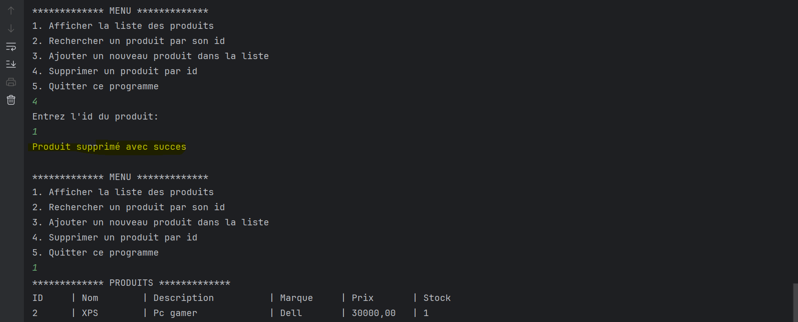
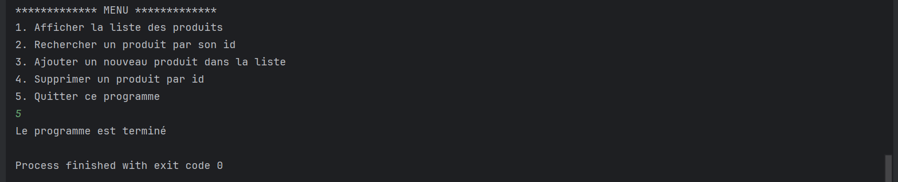

## TP sur la Généricité en Java

Ce projet est un travail pratique sur la **généricité** en Java. Il permet de gérer une collection d'objets de type `Produit` grâce à une interface générique et à son implémentation. Le programme propose un menu interactif pour effectuer différentes opérations sur les produits.

---

## Menu

### 1. Ajouter un nouveau produit dans la liste

### 2. Afficher la liste des produits

### 3. Rechercher un produit par son id

### 4. Supprimer un produit par id

### 5. Quitter ce programme

---

## Structure du Projet

- **Produit** : La classe représentant un produit.
- **IMetier** : L'interface générique pour gérer les opérations CRUD.
- **MetierProduitImpl** : L'implémentation de l'interface `IMetier`.
- **Application** : La classe principale contenant le menu interactif.

---

## Exécution

Le programme s'exécute en affichant un menu interactif où l'utilisateur peut :
1. Voir tous les produits.
2. Rechercher un produit par son ID.
3. Ajouter un produit.
4. Supprimer un produit.
5. Quitter le programme.

---
